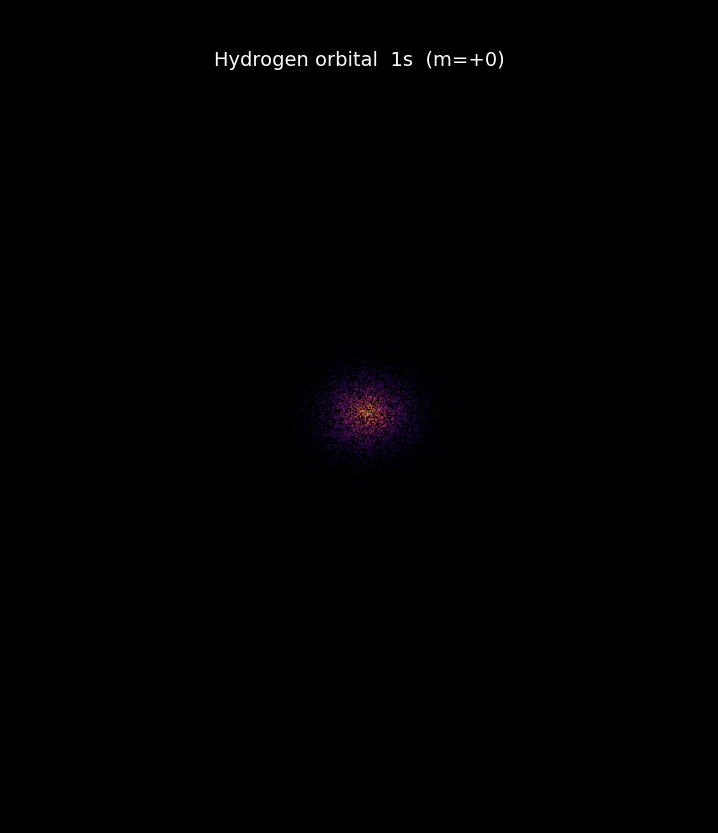
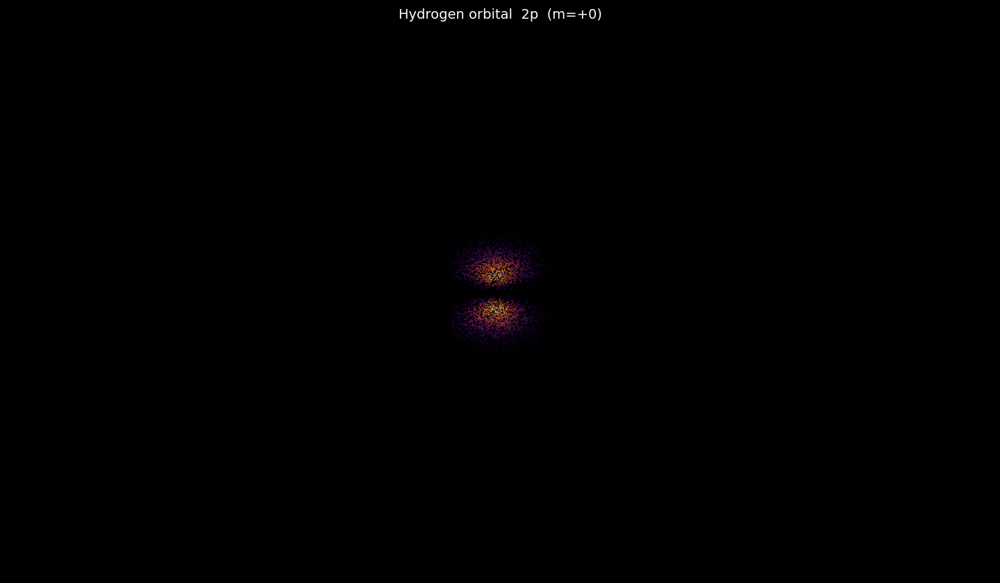
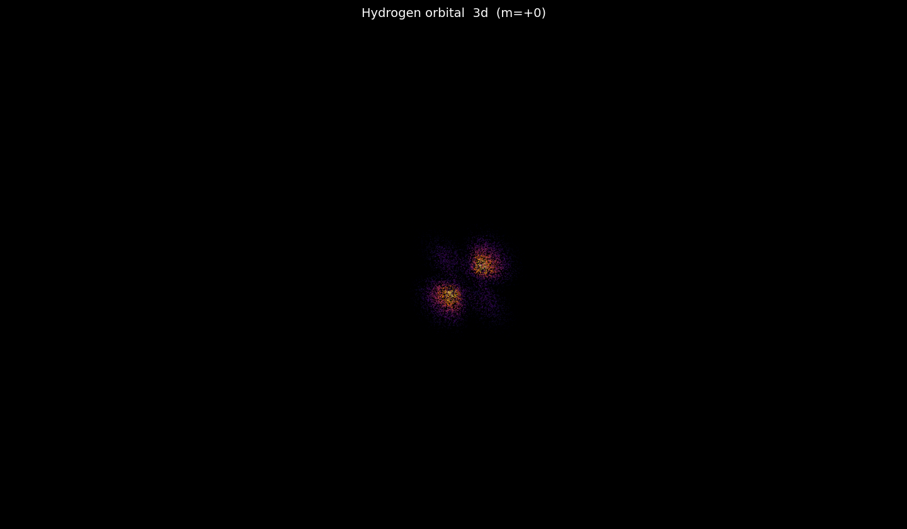
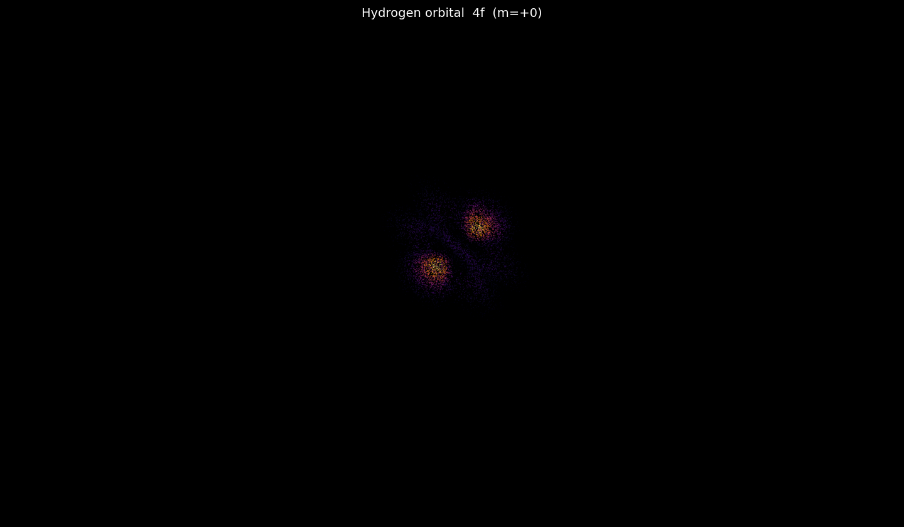

# Hydrogen Quantum Orbital Visualizer — Python

A Python port of [kavan010/Atoms](https://github.com/kavan010/Atoms) — visualizes hydrogen atomic orbitals by solving the Schrödinger equation and rendering the electron probability cloud as a 3D point cloud, colour-coded by probability.

> Original C++ version (with raytracer, realtime, and 2D modes): [kavang.com/atom](http://kavang.com/atom)

---

## Examples

| 1s | 2p | 3d | 4f |
|---|---|---|---|
|  |  |  |  |

---

## What it does

- Takes quantum numbers **(n, l, m)** that describe an orbital's shape
- Uses the **Schrödinger equation** to sample (r, θ, φ) coordinates weighted by their probability density |ψ|²
- Renders those positions as a 3D point cloud, **colour-coded by probability** — brighter areas mean the electron is more likely to be found there

---

## Requirements

- Python 3.9+
- numpy
- scipy
- matplotlib

Install dependencies:

```bash
pip install numpy scipy matplotlib
```

Or using the requirements file:

```bash
pip install -r requirements.txt
```

---

## Usage

Run the script:

```bash
python atom_orbital.py
```

To change the orbital, edit the quantum numbers at the bottom of `atom_orbital.py`:

```python
N = 3   # principal quantum number  (n ≥ 1)
L = 2   # azimuthal quantum number  (0=s, 1=p, 2=d, 3=f)
M = 0   # magnetic quantum number   (|m| ≤ l)
```

Valid combinations:

| Orbital | N | L | M |
|---------|---|---|---|
| 1s | 1 | 0 | 0 |
| 2p | 2 | 1 | 0 |
| 3d | 2 | 2 | 0 |
| 4f | 4 | 3 | 1 |

The output image is saved as `orbital.png` in the working directory.

> **Note:** Higher n values (n ≥ 4) take longer to sample — start with 1s or 2p to make sure everything is working first. The default 50,000 points is a good balance; you can lower it to ~10,000 for a quick preview.

---

## How it works

1. **Radial wave function** R_nl(r) is computed using the associated Laguerre polynomial
2. **Angular wave function** Y_lm(θ, φ) is computed using spherical harmonics
3. **Probability density** |ψ|² = |R · Y|² is used to weight each point
4. **Monte Carlo rejection sampling** — random 3D points are accepted or rejected based on their probability, so denser regions naturally appear brighter in the render

---

## Differences from the C++ version

The original C++ version uses OpenGL/GLFW for real-time interactive 3D rendering. This Python version uses matplotlib, so:

- No real-time rotation (but you can click and drag the matplotlib 3D window to rotate)
- No raytracer mode
- Slower rendering for very high particle counts

The physics and sampling logic are identical.
